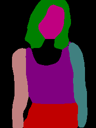
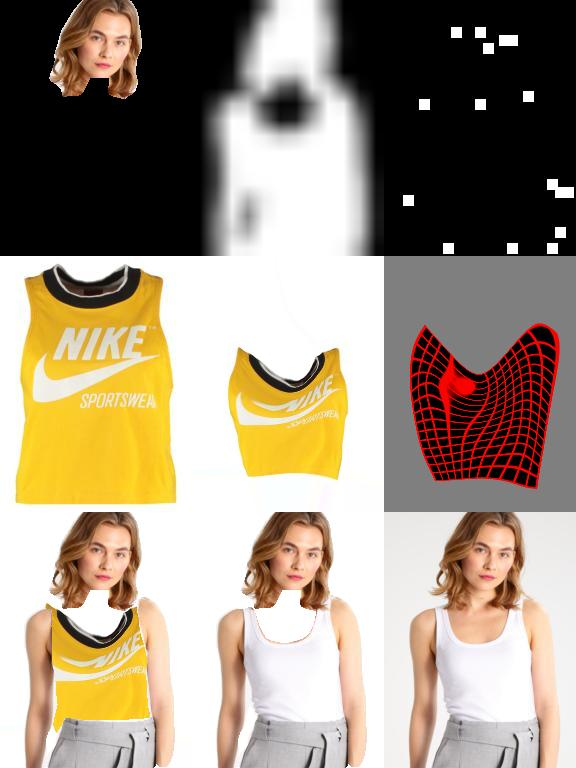
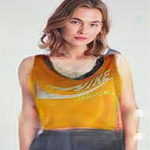

# Try on Clothes

## 🖥️ Demo









## 🔎 Danh Mục

1. [Introduction](#💡-introduction)
2. [Description](#📝-description)
3. [Implementation](#🛠️-implementation)
4. [Dataset](#🗃️-dataset)
5. [Installation](#⚙️-installation)
    - [Download repository](#download-repository)
    - [Requirements](#requirements)
    - [Pre-trained](#pre-trained)
    - [Using app](#using-app)
6. [Documents](#📃-documents)
7. [Related](#🔗-related)

## 💡 Introduction
+ The project is inspired by the needs of the dropshipping T-shirt model. It aims to enable users to upload photos of themselves to virtually try on clothes, making it easier to finalize their purchases when they find a suitable match. 

+ Try-on-clothes is an interactive web app that benefits users by allowing them to see how a particular item fits them. This virtual try-on feature not only enhances the shopping experience and revolutionizes the way people shop for clothes but also reduces costs for retailers.
## 📝 Description

+ The following project is an implementation of paper "VITON: An Image-based Virtual Try-on Network" from University of Maryland, College Park, China. https://arxiv.org/abs/1711.08447

## 🛠️ Implementation
+ Pose generation using openpose
+ Human parsing using psp-net
+ Used Generative Adversarial Networks with Adversarial loss, perceptual loss and L1 loss for smoothening.
+ Used U-Net for generator and a downsampler for discriminator.

## 🗃️ Dataset
[LIP dataset to training human parsing](https://sysu-hcp.net/lip/)

[VITON_HD dataset to training cloth mask and model](https://www.dropbox.com/scl/fi/xu08cx3fxmiwpg32yotd7/zalando-hd-resized.zip?rlkey=ks83mdv2pvmrdl2oo2bmmn69w&e=1&dl=0)
[Additional Dataset Train](https://drive.google.com/drive/folders/1UfuLsd5pyYOr_TiSwbuK1fphNEF4a7GL?usp=sharing)
## ⚙️ Installation

### Download repository
```
git clone https://github.com/HITAINTELIGENCE/Try-on-clothes.git
```

### Requirements
```
pip install -r requirements.txt
```

### Pre-trained

Download the Model files from the link provided below in the appropriate locations.

[pre_trained](https://drive.google.com/drive/folders/1eauMp5Rtf7yWVV9yKuvLeV-zpmn1-V-c?usp=sharing)

### Using app
```
streamlit run app.py
```

## 📃 Documents
[Specifically detail the activities in the article ](https://piquant-pineapple-c0d.notion.site/VITON-728018c0484d4d78b2c79f789541588a?pvs=4)

## 🔗 Related
+ [Human_parsing use pspnet](https://github.com/geekswaroop/Human-Parsing)
+ [Human_parsing use SCHP models](https://github.com/GoGoDuck912/Self-Correction-Human-Parsing?tab=readme-ov-file)
+ [VITON_GAN](https://github.com/shionhonda/viton-gan)