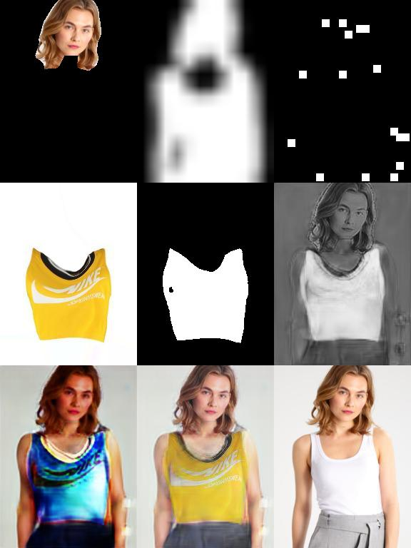

# Try on Clothes

## Demo

## Introduction

## Description

+ The following project is an implementation of paper "VITON: An Image-based Virtual Try-on Network" from University of Maryland, College Park, China. https://arxiv.org/abs/1711.08447

+ 

## Dataset

## Installation

## Documents

## Contributors

## References

